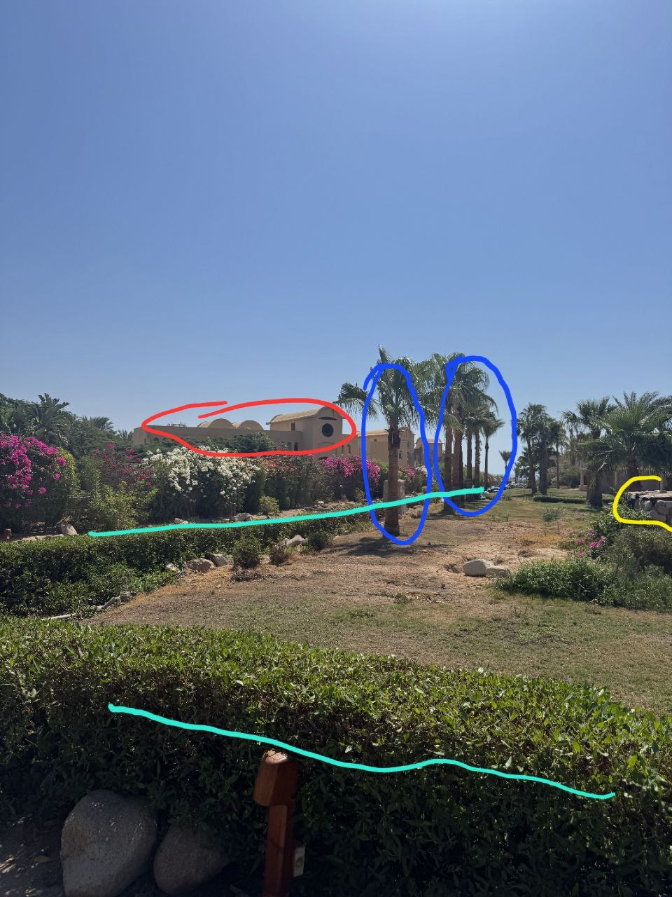
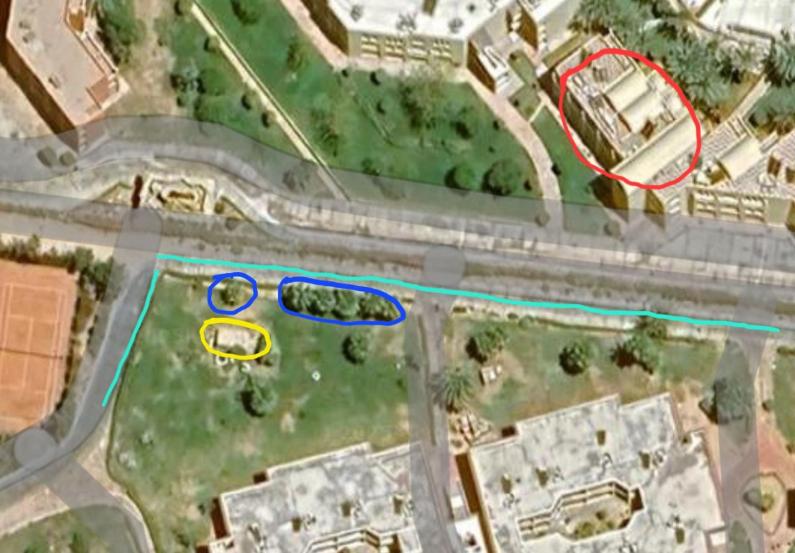

# Вот бы в отпуск... | Hard | Osint

## Информация

>Эх, отпуск...
>
>Хочется, но нужно работать, поэтому я попросил фото у знакомой, хотя бы так побываю в новом месте и изучу его.
>Вот только я сильно увлёкся и случайно узнал, где хостится сайт этого отеля. Теперь и вы попробуйте найти.
>
>Формат флага: UralCTF{hosting _provider}

## Выдать участникам

[Фото](public/otpusk.jpg)

## Описание

По фотографии нужно определить место съемки, затем определить к какому отелю относится здание.
Далее нужно найти истинный сайт отеля через их соц. сети. А потом при помощи любого whois сервиса определить хостинг провайдера, на мощностях которого работает сайт.

## Решение

Первым делом выполняем поиск по картинке и пытаемся найти похожее место. Гугл и нейронки подсказывают что здание с фотографии нужно искать в Египте в городе Sharm El Sheikh или по близости. Мне удалось найти прям похожую фотку в поиске по картинкам. Геолокация конечно была неправильная, но достаточно близко, поэтому проверять весь город не пришлось

Полноценных панорма там нет, поэтому нужно обратить внимание на детали на фотографии:

По которым без проблем можно найти место съёмки:

Далее мы переходим на точку отеля на карте, к которым относится здание на фото. На гугл картах может быть небольшая путаница, но отель там один - **Grand Plaza Resort** и его территорию можно подтвердить поискав о нём больше информации.

Затем нужно найти их настоящий сайт - `http://www.sharmgrandplaza.net`, а не сайт для бронирования номеров. Сделать это можно через их соцсети или нагуглив самостоятельно.

Теперь осталось всего лишь воспользоваться каким-нибудь whois сервисом и узнать на vps-ке какого хостинга располагается сайт.

## Флаг

`UralCTF{sharktech}`
