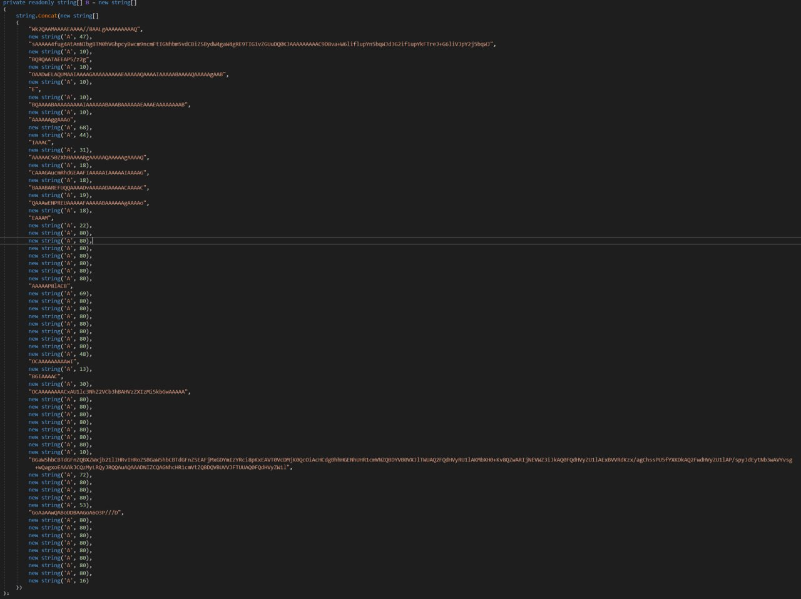
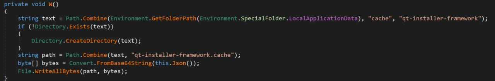
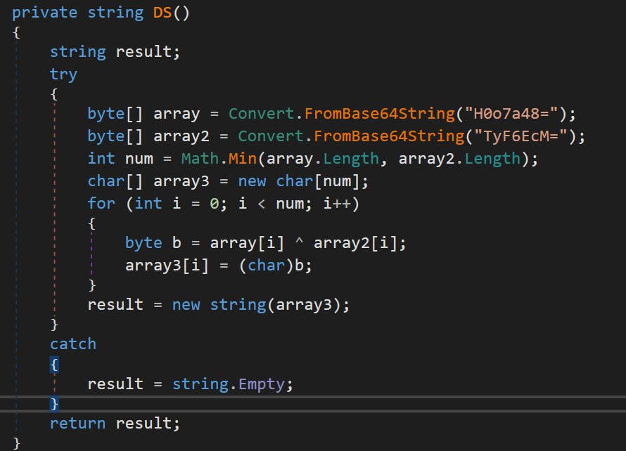
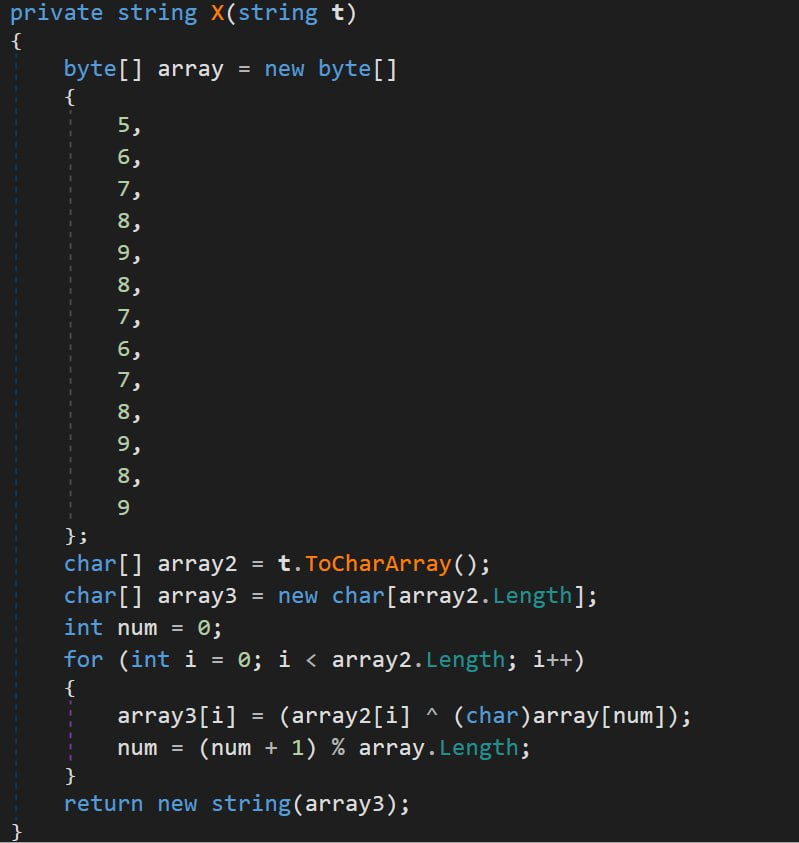
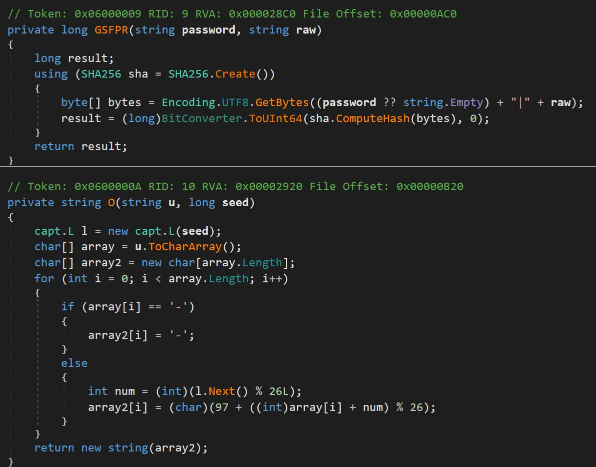

# CAPture | Medium | Reverse

## Информация

>Как же долго я возился с этой лабой... а в итоге получился какой-то дроппер.

## Выдать участникам

[Архив](public/capture.tar.gz)

## Описание

.NET-программа, которая при вводе корректного пароля и правильного "uuid" записывает файл в определённую папку, бинарный файл хранится как набор base64 кусочков в массиве B, его необходимо либо восстановить самостоятельно, либо получить в ходе корректной проверки. После — дизассемблирование

## Решение

Как только узнаём, что программа — .NET, открываем в декомпиляторе dnSpy, проанализировав код и заметив base64-куски, предположительно, файла в массиве B - 
можем решить задание двумя способами

1) Склейка base64 в массиве B, минуя все проверки
Массив строк B содержит строку base64, разделённую на части произвольной длины. Некоторые последовательности заменены на вызов new string('A', n), который генерирует строку, содержащую символ 'А' — ровно n раз. Итоговая base64 конкатинируется из массива B в результате работы метода Json()
Преобразуем все new string('A',n) в строки. Склеим части base64 воедино — [код](solve/connector.py)

2) Прохождение проверок. Файл записывается в /AppData/Local/cache/qt-installer-framework сам как qt-installer-framework.cache —  имеем это в виду

Находим DS() —  и видим две base64 строки: H0o7a48= и TyF6EcM=, они побайтово декодируются и ксорятся. Затем проводится всё тот же xor c ключом array=[5,6,7,8,9,8,7,6,7,8,9,8,9] — , для получения оригинального пароля - тот же xor, получаем "UmFrE" - [код](solve/passw.py). При вводе пароля выводится фейковый UUID, чтобы сбить участника, по факту настоящий UUID вычисляется так: считывается sha256 строки "UmFrE|123e4567-e89b-12d3-a456-426614174000" (значение после пайпа хранится в button1_Click), берутся первые 8 байт хэша и превращаются в число — сид. Он подаётся генератору случайных чисел и получается настоящий UUID — esedpbjb-qsoy-oylv-cwey-vgrkqmepteru - [код](solve/uuid.py)

После ввода UUID файл склеивается, декодируется из base64 и записывается в указанную ранее папку

Финальный этап. Прогоняем маленький ассемблерный файл в дизассемблере, несмотря на то, что его магические числа 5A4D (ZM), он всё равно идентифицируется как PE EXE, и мы можем его проанализировать, даже не меняя сигнатуру
Всё, что он делает — выводит MessageBox, только помимо этого в секции data имеется массив с шифрованным флагом и различные ключи, просто пробуем применять к массиву операцию XOR с этими ключами — верный ключ CAPtureMe выдаст флаг. Код — [xor](solve/xor.py)

## Флаг

`UralCTF{t1ny_dr0pp3rs_1n_my_f0rm5}`
